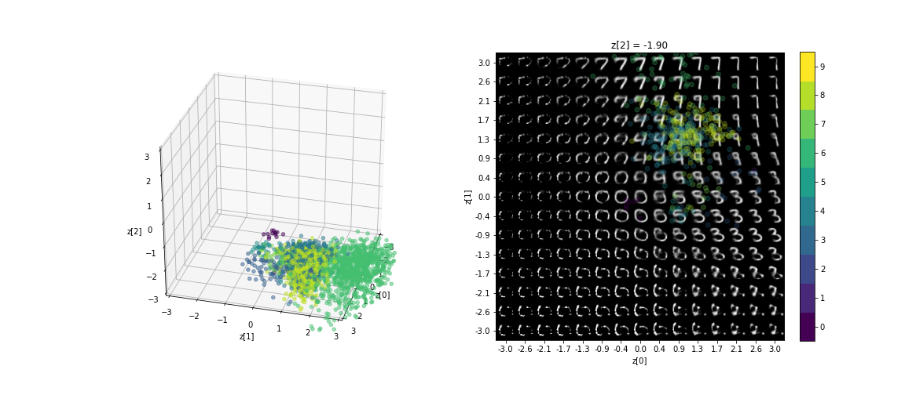

# 3D Variational AutoEncoders on MNIST digits.
Visualizing MNIST in Keras Tutorial taken from Chollet (2020) but in 3 latent dimensions.

# Example
> 

# Refrences
Chollet, François. Variational AutoEncoder: Convolutional Variational AutoEncoder (VAE) trained on MNIST digits. Keras, 2020.
